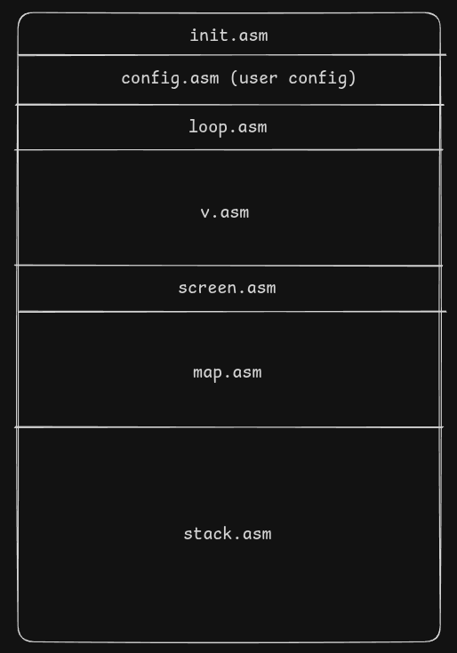

# 1.0 not done yet. This README is a draft and everything is a TODO

# v

We had ```vi```, then ```vim``` and now ```nvim```. But we are taking a step back and introducing **```v```**, a much worse ```vi```.

Text editor built in SIC/XE assembly that runs in the simulator https://github.com/jurem/SicTools.

# Usage

1. Install simulator from https://github.com/jurem/SicTools.
2. TODO: Simulator setup... (steps to open screen, freq settings, ...)

# Features

...

# How it works

## High level step by step:
- We make a <`key`, `value`> map that will store the commands.
    - The `key` is a BYTE that is the HEX of the command character
    - The `value` is a WORD that is the the address of the function
- The user can use exposed functions to do the same (following some structure). Their .asm file is assembled with all other ones.
- We wait in a loop for the user to do some command and execute that command.

## Structure

The program is assembled like this:



where:

- `init.asm` adds commands to the command Map
- `config.asm` possibly user adds commands to the command Map
- `loop.asm` waits in loop for user commands
- `v.asm` command implementations
- `screen.asm` screen interface
- `map.asm` map interface
- `stack.asm` stack interface

## TODO DEV NOTES

### FULL PRIO
- Bottom bar -> shows mode + commands (bottom 2 rows are reserved for the bottom bar)
- Commands
    - Movement
        - `h`, `b`, `0`
        - `l`, `w`, `$`
        - `k`, `g` (will be `gg` when multi-line commands are added)
        - `j`, `G`
    - Text manipulation
        - `y`, `d`, `p` -> 1 register for all (`y` and `d` yank / delete a line - will be changed when multi-line commands are added)
    - Other
        - Mode switch
            - `i`,`I`
            - `a`,`A`
            - `o`,`O`
            - `Esc`
        - :
            - `:w XX` - saves to `XX.dev`
            - `:q`
            - `!`
- `.sh` script to assemble and load the program into the simulator (with right settings)
- Config file
    - The program can expose a subroutine that can be used by the users config file that can be assembled with the main program (`.sh` flag).
    - Example of config file `vconf.asm` would maybe look like:
        ```assembly
        vconf   EXTREF add_command

        init    LDA #my_cmd
                LDB #char
                ...
                JSUB add_command
                J end

        my_cmd  ...
                ...

        end     CLEAR A
                CLEAR B
                ...

                END vconf
        ```
        - The idea is to allow the user to add their own commands. They call the exposed subroutine with needed parameters (in registers) and at the end clear needed registers for loop.asm

### LESS PRIO
- Commands
    - Movement
    - Text manipulation
        - `<X><Y>` and `p` -> 1 register for `y`, `d`, `p`
            `<X>` can be { `y`, `d` }
            `<Y>` can be { nothing, `<X>`, movement }
        - *HARDER: `u`, CTRL-R -> undo-tree fro `u` and CTRL-R (will need dynamic allocation)
    - Other
        - `r`, `R`
        - `s`, `S`
        - `c<Y>`
    - `<number><command>`
    - Visual mode
- Unlimited rows
